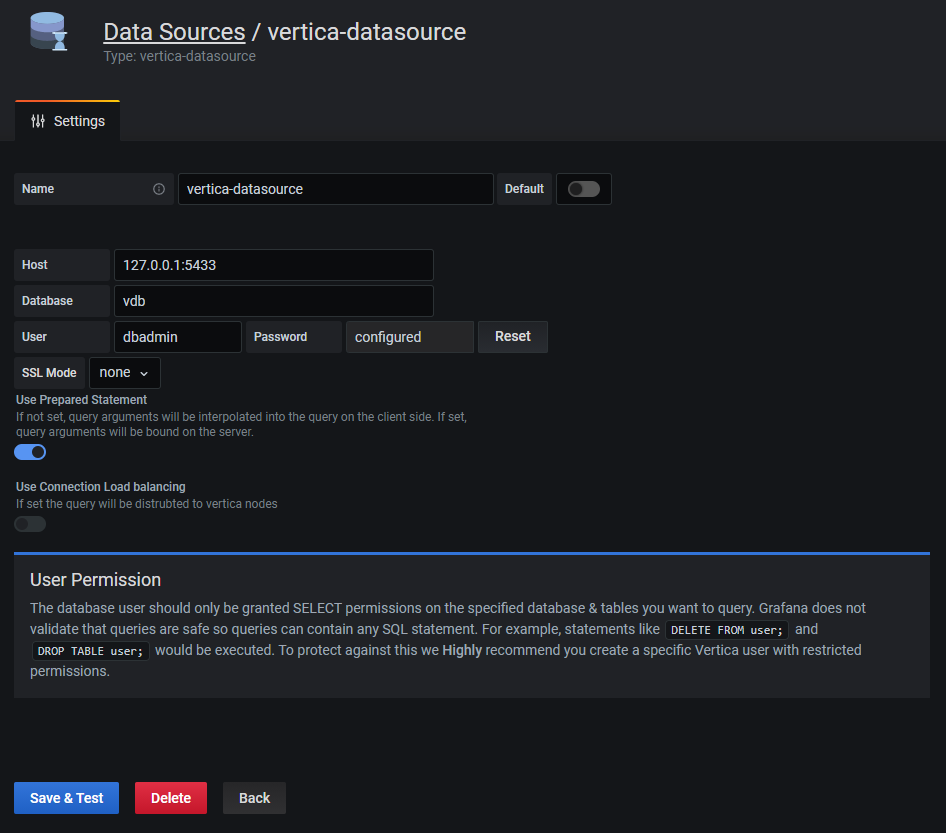
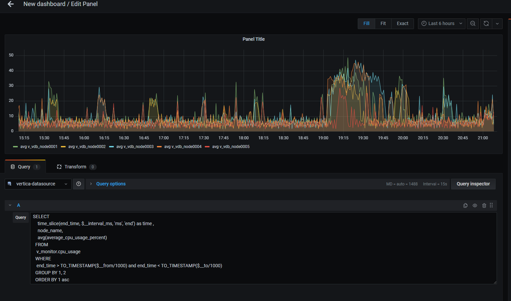
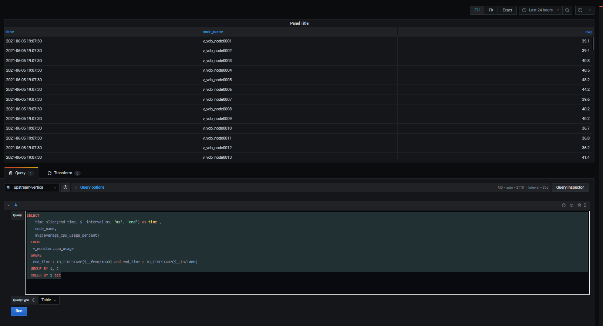
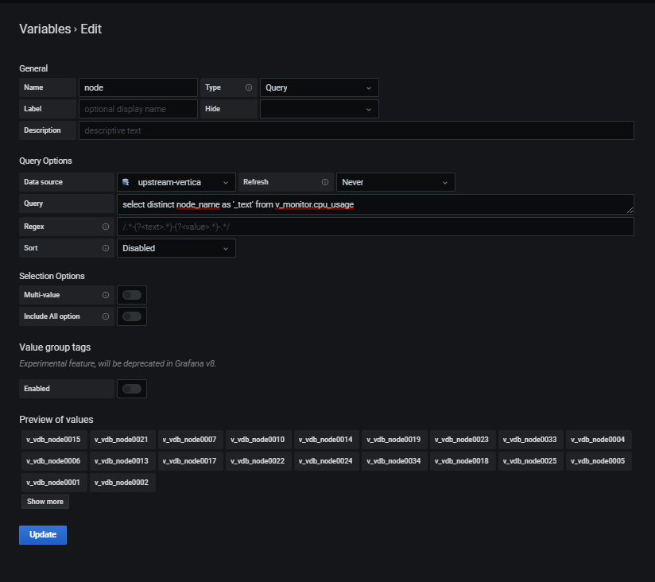
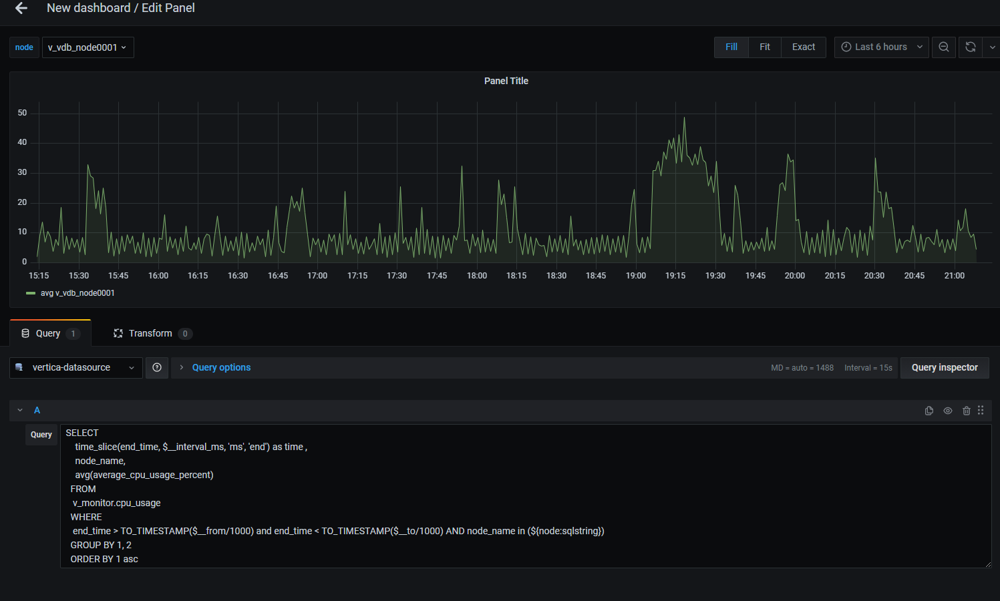
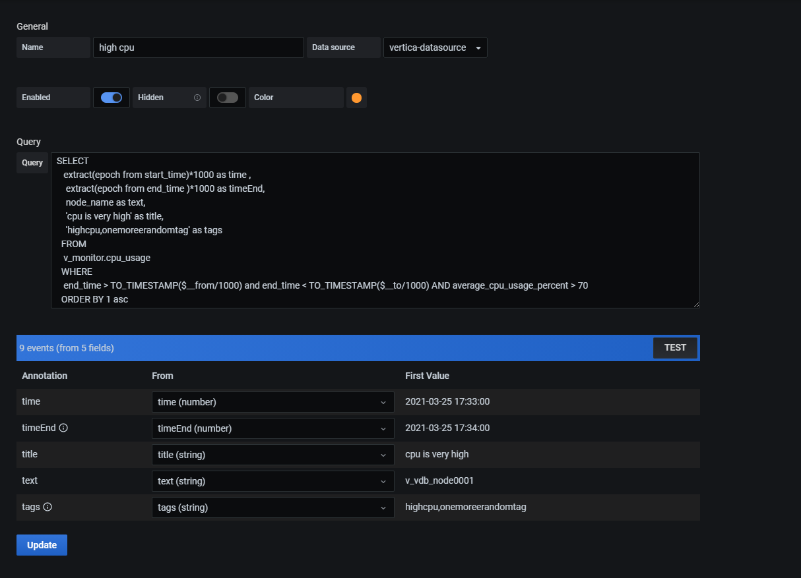
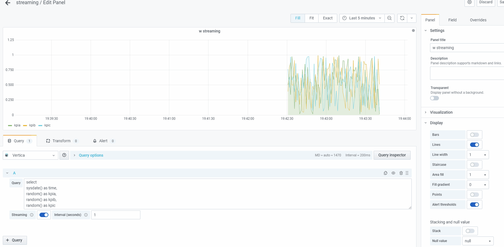

# Vertica Grafana Data Source
Grafana plugin for Vertica DB.   
New data source that communicates with Vertica using the Vertica golang driver. [http://github.com/vertica/vertica-sql-go].    
This plugin is a backend data source plugin.

## Using the plugin

### Installation
```bash
grafana-cli plugins install rajsameer-vertica-datasource
```
### Creating data source connection
1. Add Data source.

- **Name**: Data source name
- **Host**: Ip and port of vertica data base , example: *vertica-ip:vertica-port*
- **Database**: Database name
- **User**: User name of vertica database.   
  **Note**: Use a user name with less privileges. This data source does not prevent user from executing DELETE or DROP commands.
- **Password**: password for vertica Database.
- **SSL Mode**: This states how the plugin will connect to the database.Options supported are as below:   
        1. "none"
        2. "server"
        3. "server-string". 
- **Use Prepared Statement**: If unchecked, query arguments will be interpolated into the query on the client side. If checked, query arguments will be bound on the server.
- **Use Connection Load balancing**: If checked the query will be distributed to vertica nodes.
- **Set Max Open Connection**, **Ideal Connections** and **Max connection ideal time**
2. Save and test the data source.
To test the connectivity "select version()" query is executed against the database.

### Querying data.
Queried data is returned to Grafana in data-frame format.   
To lean more about data-frames please refer. https://grafana.com/docs/grafana/latest/developers/plugins/data-frames/#data-frames

- **Time series queries**   
Query type's supported are *Time Series* and *Table*. Query Type can be changed using the drop down in the query editor.   
Example: Time Series Query    
~~~~sql
SELECT 
  time_slice(end_time, $__interval_ms, 'ms', 'end') as time , 
  node_name,
  avg(average_cpu_usage_percent)
FROM 
  v_monitor.cpu_usage 
WHERE 
  end_time > TO_TIMESTAMP($__from/1000) and end_time < TO_TIMESTAMP($__to/1000)
GROUP BY 1, 2
ORDER BY 1 asc
~~~~

No macros are used in the data source. Instead grafana global variables are used.   
Example: "time_slice(end_time, $__interval_ms, 'ms', 'end') as time" following statement helps the quey to honor the interval of visualization. $__interval_ms is a grafana global variables.   
Time filter:   
Example: "end_time > TO_TIMESTAMP($__from/1000) and end_time < TO_TIMESTAMP($__to/1000)"  this convert the the global $__from and $__to variables from grafana, to a timestamp format for vertica.   


Table Query
~~~~sql 
SELECT 
  time_slice(end_time, $__interval_ms, 'ms', 'end') as time , 
  node_name,
  avg(average_cpu_usage_percent)
FROM 
  v_monitor.cpu_usage 
WHERE 
  end_time > TO_TIMESTAMP($__from/1000) and end_time < TO_TIMESTAMP($__to/1000)
GROUP BY 1, 2
ORDER BY 1 asc
~~~~
Choose Query Type as *Table*    


### Variables:
Variables can be easily defined as sql queries, the only restriction is query should return at least one column with "**_text**" name.
If the query has two columns "**_text**" and "**_value**", **_text** would be used as the display value and **_value** would be applied to filter.

Example:

Query:
~~~~sql 
select distinct node_name as '_text' from v_monitor.cpu_usage 
~~~~


Usage:
Grafana [Advanced formatting options]https://grafana.com/docs/grafana/latest/variables/advanced-variable-format-options/.
In this example we create a multi select variable of node name , use ${node:sqlstring} for template in the query. 


## Annotations

Annotations are supported from grafana 7.2+   


To use annotations, write any query which will return time, timeEnd, text, title and tags column as shown in the image.   

## Streaming (new) (beta)
Added support for streaming


Example Query
```SQL
  SELECT 
    end_time as time , 
    avg(average_cpu_usage_percent)
  FROM 
   v_monitor.cpu_usage 
  WHERE 
   end_time > TIMESTAMPADD(MINUTE, -1 , CURRENT_TIMESTAMP)
  GROUP BY 1
  ORDER BY 1 asc
```
This will get the latest data from the data base and keep appending the samples.

## Time gap filling (new) (beta)
SQL data can return data which do not have sample for the entire time range , e.g. you could have gaps in the data.    
This feature provide two modes which will add the missing time rows with either null or static values.   
Two modes are **static** and **null**. More modes would come in future.


## SQL syntax highlighting (new) (beta)
SQL syntax highlighting added using CodeMirror library. In future would add auto complete and formatting.

## Debugging

You can debug the backed code using dlv.
In order to debug the code.
1. Compile the backend code with debug options.
```BASH 
mage -v debugger
```
2. Restart grafana server
```BASH 
systemctl restart grafana-server
```
3. Get the pid of the plugin process 
```BASH 
pgrep vertica
```
4. Use the pid from 3 step and use it in the below statement to start debugger
```BASH 
dlv attach <"pid from step 3"> --headless --listen=:3222 --api-version 2 --log
```
5. Now you can use the vscode and debug option , configuration debugging is present in launch.json

## Development

Prerequisite
 1. Node JS 14+
 2. Go version 1.14+
 3. yarn

Install
```BASH
yarn install
```
Build
 1. **Frontend** 
    ```BASH
    yarn build
    ``` 
 2. **Backend** mage -v
    ```BASH
    mage -v
    ``` 

## Testing
 ```BASH
sudo docker-compose up
```
This will run a local vertica and grafana instance.   
A data source and data source will already be provisioned.


